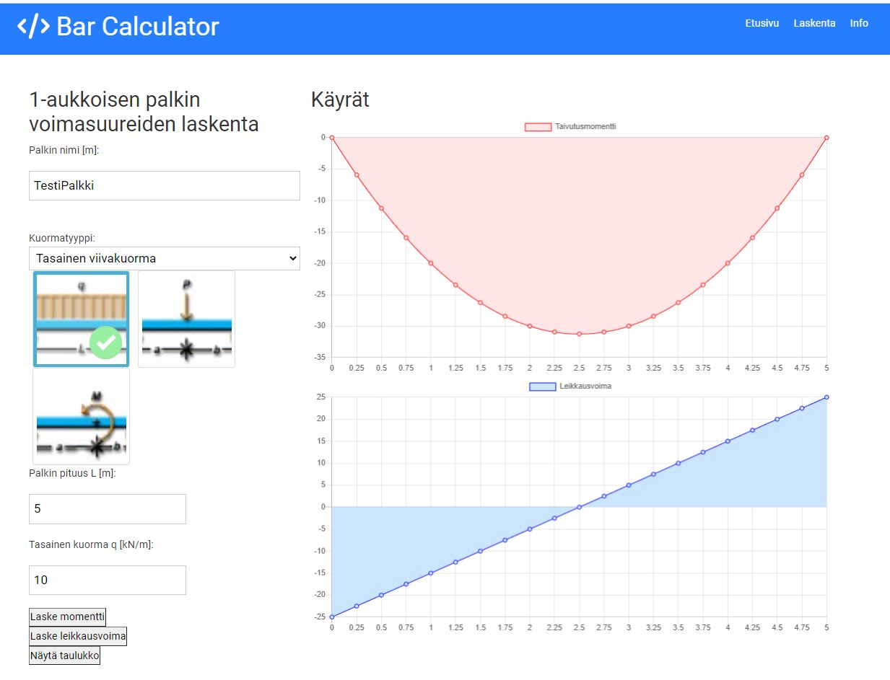

This is the source code for https://youtu.be/c_9c5zkfQ3Y

This is the project from the [YouTube crash course](https://www.youtube.com/watch?v=w7ejDZ8SWv8). 
It includes the react ui as well as JSON-server for our mock backend

## Usage

### Install dependencies

```
npm install
```

### Run React dev server (http://localhost:3000)

```
npm start
```

### Run the JSON server (http://localhost:5000)

```
npm run server
```

### To build for production

```
npm run build
```
## Kuvaus ohjelmasta
Ohjelma laskee 1-aukkoisen palkin taivutusmomentti- ja leikkausvoimakuviot ja 
tallentaa niistä maksimitulokset paikallisesti db.json filuun. 
Jatkossa on myös tarkoitus tehdä tallennus tietokantaan.

## Ohjelman käynnistys
Frontend käynnistetään terminaalissa komennolla: "npm start"
Backend json-server käynnistetään toisessa terminaalissa komennolla: "npm run server"

## Ohjelmassa käytettyjä elementtejä
- React
- react-router-dom
- react-chartjs-2
- react-image-picker
- Luodaan List-taulukko esim. setFormData({ ...formData, maxM: m5 }) <= formData-listan maxM-muuttujaan lisätään arvo m5
- props (muuttujien arvot viedään tiedostolta toiselle props-muuttujana)
- Hooks: useState, useEffect, useRef
- express
- json-server
- Fetch API:lla hakupyynnöt backend:lle
- json-tiedoston tallennus
### Kuva Layout:sta


## Fullstackohje

https://www.youtube.com/watch?v=gpfP60KjmZU

## Ohje Result-taulukon päivitykseen

https://github.com/machadop1407/multi-step-form-react
https://www.w3schools.com/react/react_usestate.asp 
ohjeessa luotu useState:lla taulukko, jonka arvoja päivitetään eri tiedostojen kautta

